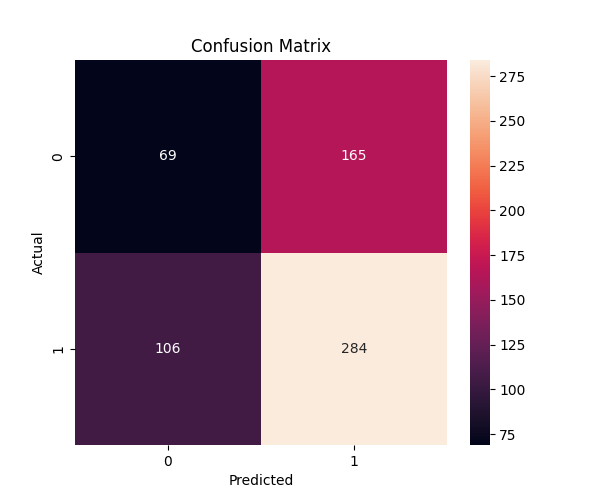

# pneumonia-analysis

# Pneumonia Classification using Deep Learning,
## Overview,
This project uses CNN and VGG16 (transfer learning) to classify chest X-ray images into Normal and Pneumonia.

## Model,
Baseline CNN,
VGG16 (fine-tuned),

## Results,
Test Accuracy: 87%,
Recall (Pneumonia): 99%,

## Insight,
The model prioritizes detecting pneumonia (high recall), minimizing false negatives, which is critical in medical diagnosis.

## Confusion Matrix,

