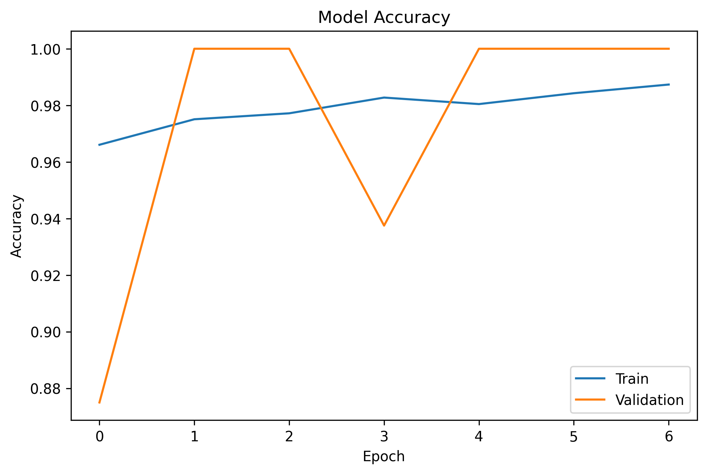
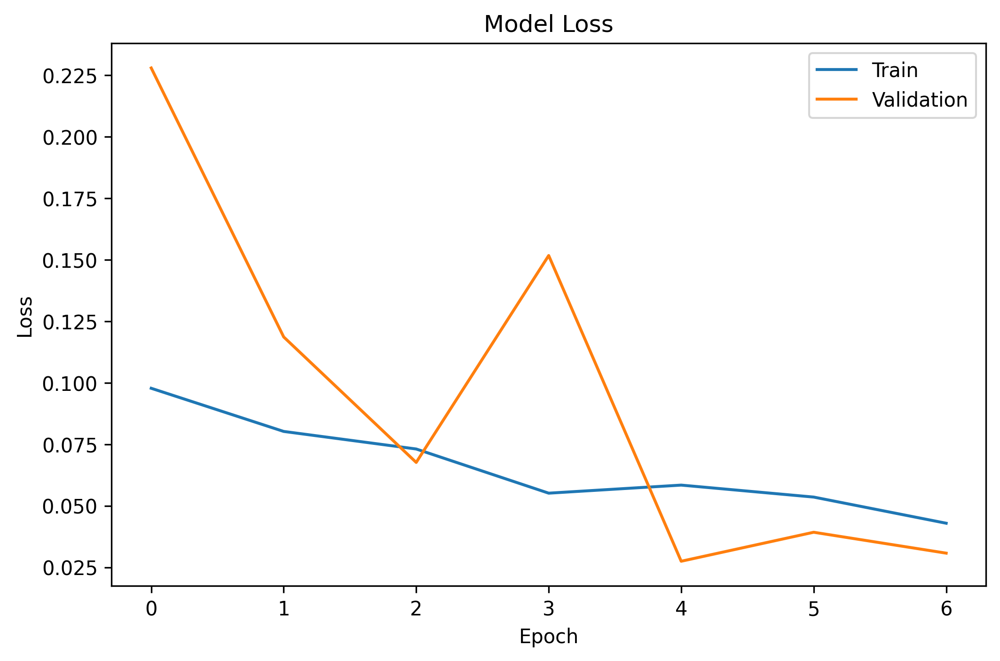
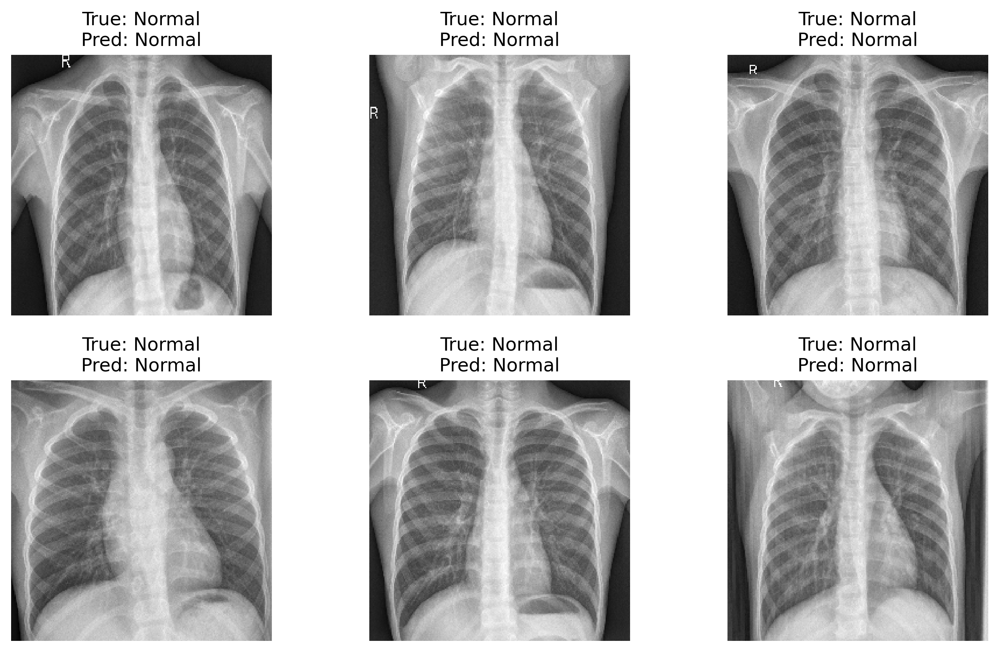

# Pneumonia Classification using Deep Learning,
 
## Overview
This project focuses on classifying chest X-ray images into Normal and Pneumonia using deep learning techniques.

Two approaches were explored:
1. Convolutional Neural Network (CNN) from scratch,
2. Transfer Learning using VGG16,

---

## Objective
To build a reliable model for pneumonia detection and analyze its performance, especially in minimizing false negatives (critical in medical diagnosis).

---

## Models

CNN (Baseline)
- Built from scratch
= Accuracy: ~80%
= Observed overfitting

VGG16 (Transfer Learning)
- Pretrained on ImageNet
- Fine-tuned last layers
- Improved generalization

---

## Results
Test Accuracy: 87%

Classification Performance
 - Pneumonia Recall: 0.99
 - Normal Recall: 0.67

---

## Confusion Matrix

---

## Training Performance
Accuracy

Loss

---

## Sample Predictions

---

## Key Insights
- The model achieves high recall for pneumonia (0.99), minimizing false negatives
- Some false positives occur (normal predicted as pneumonia)
- This indicates a bias toward sensitivity, which is preferable in medical contexts
- Validation accuracy reached 100%, but test accuracy (~87%) reflects realistic performance

---

## Limitations
- Dataset is imbalanced (more pneumonia cases than normal)
- Validation set is relatively small
- Model may over-predict pneumonia

---

## Tools & Technologies
- Python
- TensorFlow / Keras
- OpenCV
- Matplotlib / Seaborn

---

## How to Run,
1. Install dependencies:

   pip install -r requirements.txt

2. Open Notebook:
   notebook/pneumonia_classification.ipynb

3. Run all cells

---

## Dataset
Chest X-ray Pneumonia dataset from Kaggle.

---

# Author
nasaka
